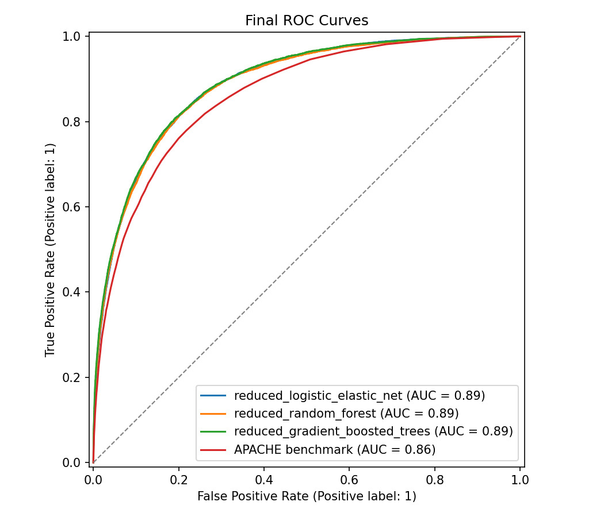
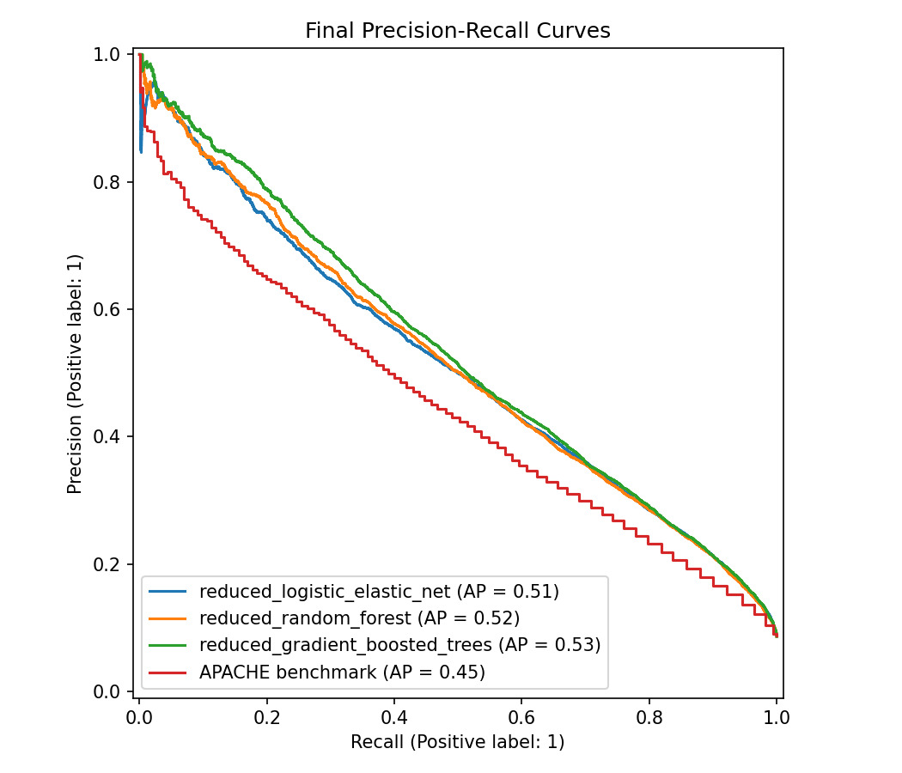

# Medicine Prediction Models

Course workflow for predicting ICU in-hospital mortality from the WiDS Datathon 2020 data.

The model output is mortality probability:

```text
P(hospital_death = 1)
```

## Setup


```
python -m pip install -r requirements.txt
```

## Main Reduced-Feature Run

The current report-ready workflow uses the reduced feature set without
high-cardinality site and diagnosis-code columns:

```
python -m src.train --config-dir configs/reduced_logistic --output-dir outputs/reduced_logistic_no_codes
```

This trains:

- `reduced_logistic_lasso`
- `reduced_logistic_elastic_net`
- `reduced_random_forest`
- `reduced_gradient_boosted_trees`

The reduced feature set excludes:

- `hospital_id`
- `icu_id`
- `apache_2_diagnosis`
- `apache_3j_diagnosis`

Outputs are written under:

```text
outputs/reduced_logistic_no_codes/models/
outputs/reduced_logistic_no_codes/reports/
outputs/reduced_logistic_no_codes/figures/
outputs/reduced_logistic_no_codes/predictions/
outputs/reduced_logistic_no_codes/shap/
```

## Final Plots





In this final comparison, the reduced logistic elastic-net, random forest, and
gradient-boosted trees all reach ROC AUC around 0.89, compared with 0.86 for the
APACHE benchmark. Precision-recall performance also improves over APACHE, with
average precision around 0.51 to 0.53 versus 0.45 for the benchmark.

## Optional Baseline Models

Run the original logistic-regression configs:

```powershell
python -m src.train
```

This trains:

- `logistic_baseline`
- `logistic_ridge`
- `logistic_lasso`
- `logistic_elastic_net`

## Optional Nested Tuning

Run nested grid search for configs with `search_grid` entries:

```powershell
python -m src.train --tune
```

This uses 5 outer folds for performance reporting and 3 inner folds for
hyperparameter selection. Tuned outputs are prefixed with `tuned_`.

## Optional Tree-Based Models

Run only the separate tree-model configs:

```powershell
python -m src.train --config-dir configs/tree_models
```

This keeps the same raw-data preprocessing pipeline used by the logistic models.
The gradient boosted tree config uses scikit-learn's histogram gradient boosting
implementation for practical runtime on this dataset.

## Modeling Notes

- Target: `hospital_death = 1`.
- Cohort filtering excludes known pediatric patients (`age < 18`) and keeps missing-age records for imputation.
- The stage-1 "less than 4 ICU hours" exclusion is not applied by default because the dataset contains `pre_icu_los_days`, not ICU length of stay.
- Models use raw training columns except the target, row/patient identifiers, APACHE prediction probability columns, and any model-specific excluded features. Raw categorical variables and categorical numeric codes are one-hot encoded unless excluded.
- APACHE prediction columns are not training features because they are already mortality model outputs. `apache_4a_hospital_death_prob` is reported separately as a benchmark.
- Poisson regression is skipped because the outcome is binary, not a count.
